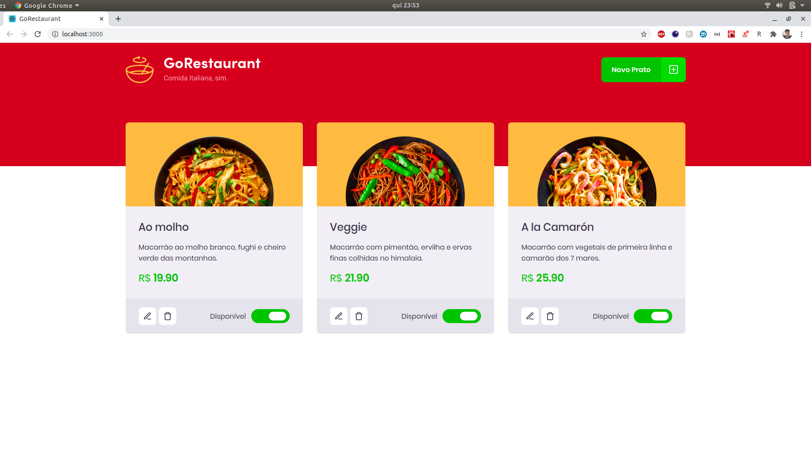
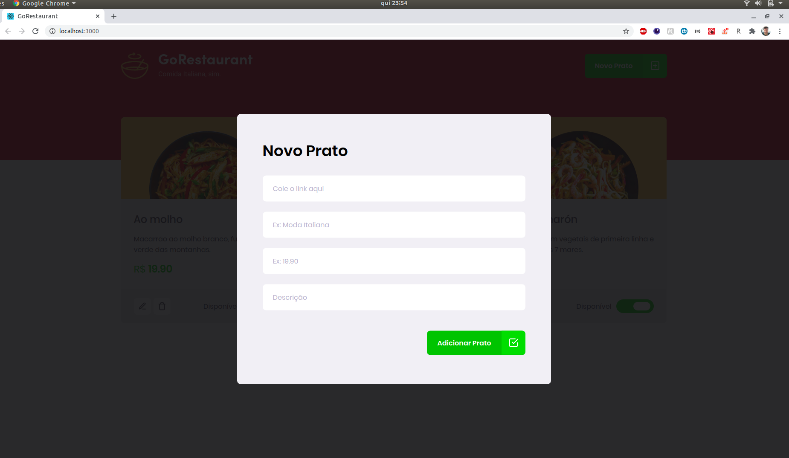
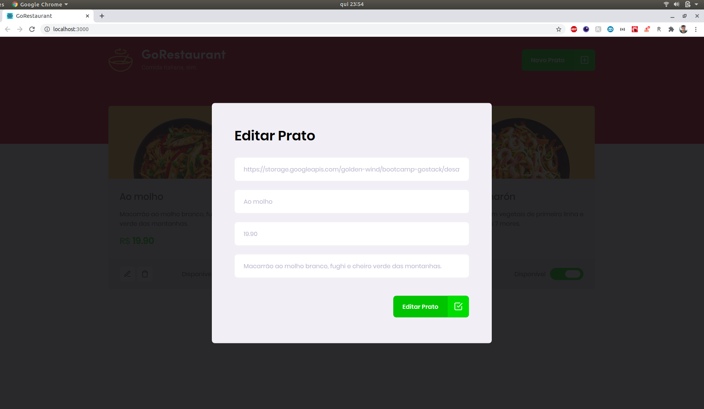

# Sobre o desafio
Desenvolvimento da aplicação GoRestaurant, praticando o conceito de CRUD (Create, Read, Update, Delete).
Essa será uma aplicação que irá se conectar a uma fake API, e exibir os pratos de comida criados e permitir a criação, remoção e atualização desses pratos.






## Utilizando uma fake API
Nesse desafio foi usado os dados de uma fake API, para roda-la é necessário executar o comando:
```js
  yarn json-server server.json -p 3333
```

## Funcionalidades da aplicação
* Listar os pratos de comida da sua API
* Adicionar novos pratos de comida a sua API
* Editar pratos de comida da sua API
* Remover pratos de comida da sua API
* Alterar disponibilidade dos pratos de comida da sua API

## Quick Start
Primeiramente, para instalar as dependências deve ser executado o comando:
```js
  yarn
```
Para iniciar a aplicação deve ser executado o comando:
```js
  yarn start
```
